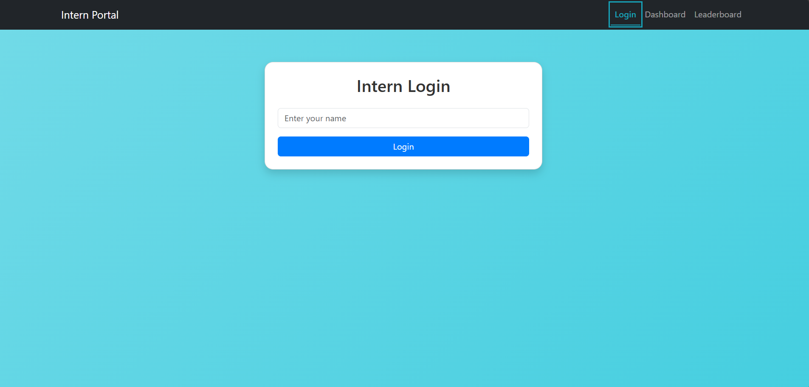
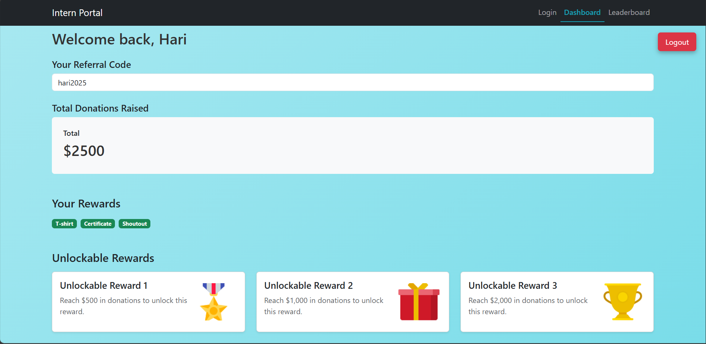
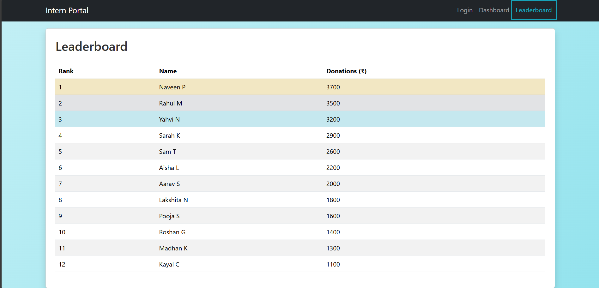

# 🌐 Intern Portal

A simple full-stack intern dashboard built as part of the **She-Can Foundation Internship Program**.

This project allows interns to log in with a name, view their referral code, donation stats, rewards, and check a leaderboard — all within a smooth, responsive interface.

---

## 🚀 Features

- 🔐 **Dummy Login** (no authentication)
- 🧑 **Dashboard** with:
  - Intern Name
  - Referral Code (e.g., `yourname2025`)
  - Total Donations Raised
  - Earned & Unlockable Rewards
- 🏆 **Leaderboard** with top performers
- 🎨 Clean and animated UI using **React + Bootstrap**

---

## 🖼️ Screenshots

### 🔑 Login Page

### 📊 Dashboard

### 🏅 Leaderboard

---

## 🛠️ Tech Stack

**Frontend**: React, Bootstrap  
**Backend**: Node.js, Express  
**State Management**: useState, useEffect (React Hooks)

---

## 📂 Folder Structure
intern-portal/
├── client/ # React frontend
├── server/ # Express backend
├── img/ # Screenshots for README
├── README.md
├── .gitignore

🔧 How to Run
1. Clone the Repository
bash
Copy code
git clone https://github.com/Naveen2094/Intern-Portal.git
cd intern-portal

3. Install Client Dependencies
bash
Copy code
cd client
npm install

5. Install Server Dependencies
bash
Copy code
cd ../server
npm install

7. Run the Backend
bash
Copy code
node server.js

9. Run the Frontend
bash
Copy code
cd ../client
npm start

The app will be running at: http://localhost:3000

💡 Credits
Built with 💻 by Naveen Kumar P during the She-Can Foundation Internship.
